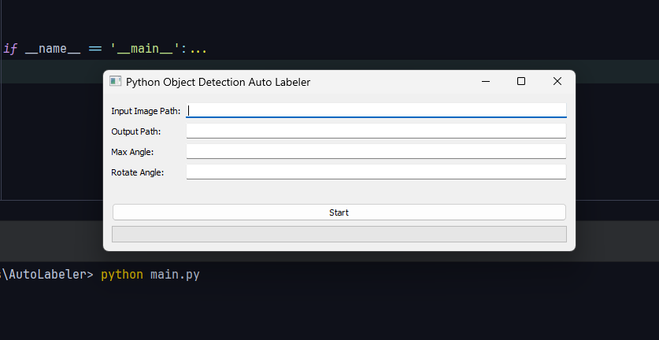

# YOLO Auto Labeler with Python

This project is designed to enhance your object detection datasets by automatically generating new data through rotation. By leveraging Python, the tool takes your previously labeled YOLO datasets and applies rotation transformations to create additional labeled data, effectively expanding your dataset and improving the robustness of your object detection models.

### Features

- **Automatic Data Augmentation**: Easily rotate existing labeled data to generate new datasets.
- **Customizable Rotation Angles**: Specify the degree of rotation to fine-tune the augmentation process according to your needs.
- **Seamless Integration with YOLO**: Compatible with YOLO format labels, ensuring that your data is ready for training without any additional conversion steps.

### Usage

Once the environment is set up, you can start using the YOLO Auto Labeler to augment your datasets. Follow these steps:

1. **Prepare Your Data**  
   Ensure that your existing YOLO datasets are correctly formatted and placed in the designated input folder.

   **Your input folder structure must be like this;**
   ```shell
   -- input
      -- classes.txt
      -- example_labelled_image.png
      -- example_labelled_image.txt
   ```

2. **Run the Script**  
   Execute the main script and specify the following parameters:

   - **Input image path**: Specifies where the input data (images and labels) will be loaded from.
   - **Output Path**: Specifies where the augmented data will be saved.
   - **Max Angle**: Defines the total degree to which the images will be rotated.
   - **Rotate Angle**: Specifies the degree of rotation applied at each step.

   

3. **Review the Output**  
   Check the output folder to see the newly generated images and labels, ready for use in your object detection training pipeline.

### Prerequisites

- Python 3.6 or higher
- Conda or virtualenv (recommended for managing dependencies)
- Basic understanding of object detection and YOLO format labels

### Installation

Follow these steps to set up the project locally:

1. **Clone the Repository**  
  Begin by cloning the repository to your local machine:
   ```shell
   git clone https://github.com/sedat-unal/YoloAutoLabelWithPython.git
   ```

2. **Navigate to the Project Directory** 
  Change to the project directory:
   ```shell
   cd YoloAutoLabelWithPython
   ```

3. **Install Required Dependencies** 
  Install the necessary Python packages using pip. It's recommended to do this within a conda environment:
   ```shell
   pip install -r requirements.txt
   ```
